# Decision Diagram Studio — アーキテクチャ設計書

**バージョン:** 2.0
**対象アプリバージョン:** v0.1-studio〜v1.0-studio
**作成日:** 2026-05-10
**改訂日:** 2026-05-10
**ステータス:** Approved（レビュー反映版）

---

## 目次

- [A. システム全体像](#a-システム全体像)
- [B. ビュー別記述](#b-ビュー別記述)
  - [B1. コンテキストビュー](#b1-コンテキストビュー)
  - [B2. 機能ビュー](#b2-機能ビュー)
  - [B3. 情報ビュー](#b3-情報ビュー)
  - [B4. 並行性ビュー](#b4-並行性ビュー)
  - [B5. ランタイム/シナリオビュー](#b5-ランタイムシナリオビュー)
  - [B6. 開発ビュー](#b6-開発ビュー)
  - [B7. 配置ビュー](#b7-配置ビュー)
  - [B8. 運用ビュー](#b8-運用ビュー)
  - [B9. セキュリティビュー](#b9-セキュリティビュー)
- [C. 品質パースペクティブ](#c-品質パースペクティブ)
- [D. 設計判断（ADR）](#d-設計判断adr)
- [E. トレーサビリティ](#e-トレーサビリティ)
- [F. フェーズ別アーキテクチャ差分](#f-フェーズ別アーキテクチャ差分)
- [G. 未解決事項](#g-未解決事項)

---

## A. システム全体像

### A.1 目的

Decision Diagram Studio（以下、本アプリ）は、BDD・ZDD・MTBDD・ZMTBDD の四種類の Decision Diagram を対話的に学習・実験・可視化するための Windows デスクトップアプリケーションである。

コアアルゴリズムは `DecisionDiagramSharp` ライブラリに完全委譲し、本アプリは **UI / UX / ビジュアライゼーション / エクスポート** に専念する。これにより、ライブラリの進化と UI の進化を独立させる。

### A.2 制約

| 種別 | 内容 |
|---|---|
| プラットフォーム | Windows 10 v2004（build 19041）以降、x64 のみ |
| フレームワーク | WinUI 3 / Windows App SDK、.NET 8 |
| 言語 | C# 12（ライブラリと同一言語） |
| スレッドモデル | `BddManager` 等は非スレッドセーフ。`DecisionDiagramManager` の全操作は `SemaphoreSlim(1)` で保護した単一 critical section 内で実行する |
| 外部依存 | Graphviz はオプション（未インストール時はフォールバック動作） |
| ライブラリ依存 | `DecisionDiagramSharp` をサブモジュールとして `lib/` 以下に置き、プロジェクト参照で利用する（NuGet 公開後は切り替え可） |
| ロギング依存 | `Serilog`（`Serilog.Sinks.File`・`Serilog.Sinks.Debug`）を必須依存として使用する。`ILogger<T>` 抽象を経由するため他層はSerilogに直接依存しない |

### A.3 主要な品質目標

優先度順に列挙する。

| 優先度 | 品質特性 | 目標 |
|---|---|---|
| 1 | **正確性** | ライブラリの計算結果を UI が正しく反映する |
| 2 | **応答性** | 固定ミリ秒閾値を合格条件にせず、UI スレッドを塞がない非同期処理とキャンセルで操作不能状態を避ける |
| 3 | **保守性** | ViewModel / Service / View を明確に分離し、単一責任を維持する |
| 4 | **テスト容易性** | Service・ViewModel はインターフェースを介して結合し、モックに置換可能にする |
| 5 | **学習支援性** | 削減前後（BDT vs BDD）の比較と解説パネルを常に利用可能にする |

### A.4 アーキテクチャ方針

1. **MVVM を厳守する** — View と ViewModel の直接依存を禁止する。View は XAML データバインディングのみを通じて ViewModel を参照する。
2. **Service 層を薄い変換レイヤーに保つ** — ライブラリの API をそのまま公開せず、アプリ固有の概念（`DiagramSession`）に変換して ViewModel に渡す。
3. **ライブラリ具象型をモデル層に漏らさない** — `DiagramSession` はライブラリ型（`Bdd`, `Zdd`, `Mtbdd`, `Zmtbdd`）を保持しない。ハンドルは `DiagramService` の private フィールドにのみ存在する（ADR-006）。
4. **ライブラリを汚染しない** — `lib/DecisionDiagramSharp` の内部コードは一切変更しない。拡張は `DecisionDiagramStudio` 側に書く。
5. **UI スレッドを専有しない** — 重い計算（BDD 構築・Graphviz 実行）は `Task.Run` で非同期化し、結果を `DispatcherQueue` 経由で UI へ返す。
6. **Graphviz を必須にしない** — グラフ描画以外の機能（真理値表・エクスポート）は Graphviz なしで動作する。
7. **Undo/Redo は Command パターンで実装する** — ViewModel はコマンドオブジェクトを `CommandStack` に積む。
8. **DI コンテナを App.xaml.cs 1 か所に集約する** — サービスロケーターパターンを使わない。
9. **変数名入力は入口でバリデーションする** — `[a-zA-Z_][a-zA-Z0-9_]*` のみ許可し、DOT インジェクションを防ぐ。

---

## B. ビュー別記述

### B1. コンテキストビュー

本アプリが外部システム・ユーザー・ライブラリとどう連携するかを示す。

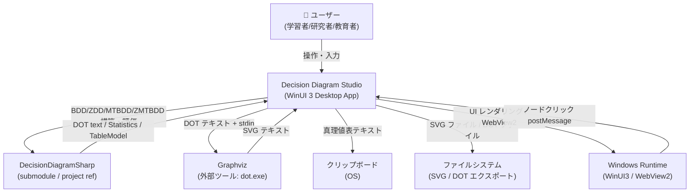

**外部システムとのインターフェース一覧:**

| 外部システム | 方向 | プロトコル / 形式 | 必須 |
|---|---|---|---|
| DecisionDiagramSharp | 双方向 | .NET プロジェクト参照 | Yes |
| Graphviz (`dot.exe`) | 呼び出し | stdin (DOT) → stdout (SVG) | No（フォールバックあり） |
| OS クリップボード | 書き込み | プレーンテキスト（CSV/MD/AsciiDoc） | No |
| ファイルシステム | 書き込み | SVG / DOT テキスト | No |
| WebView2 | 双方向 | HTML/SVG 表示 + postMessage（JSON） | Yes |

---

### B2. 機能ビュー

アプリの主要な機能コンポーネントとその責務を示す。

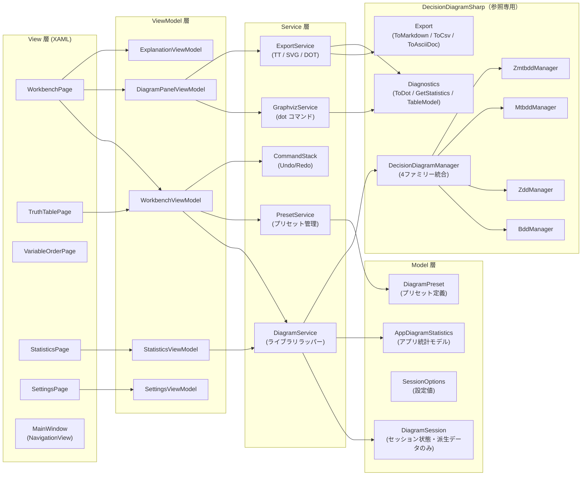

**各コンポーネントの責務:**

| コンポーネント | 責務 | 禁止事項 |
|---|---|---|
| `WorkbenchViewModel` | 入力状態の管理・コマンド処理・ViewModel 間の調整 | ライブラリ直接呼び出し |
| `DiagramPanelViewModel` | グラフ表示状態（削減前後・SVG）の管理 | ファイル IO |
| `ExplanationViewModel` | ノード選択と解説テキストの管理 | 計算ロジック |
| `StatisticsViewModel` | 統計値（ノード数等）の整形・表示 | グラフ描画 |
| `DiagramService` | `DecisionDiagramManager` のライフサイクル管理・ハンドル保持・`DiagramSession` への変換・BDT DOT 生成 | UI 操作、ライブラリ具象型の外部公開 |
| `GraphvizService` | `dot` プロセスの起動・タイムアウト管理・SVG 取得 | 図の解釈 |
| `ExportService` | TT / SVG / DOT エクスポートの実行 | UI 操作 |
| `PresetService` | プリセット一覧の提供・プリセットから入力データへの変換 | ライブラリ直接操作 |
| `CommandStack` | `IUndoableCommand` の Push/Undo/Redo 管理（上限 50） | ビジネスロジック |

**ファミリー別責務対応表:**

| 観点 | BDD | ZDD | MTBDD | ZMTBDD |
|---|---|---|---|---|
| **入力型** | `int[]`（0/1 値テーブル、LSB-first） | `IReadOnlyList<IReadOnlyList<string>>`（集合族） | `int[]`（整数値テーブル、LSB-first） | `int[]`（スパース整数値テーブル、LSB-first） |
| **構築 API** | `DiagramService.BuildBddFromTruthTable()`（IQ-01 参照） | `ZddManager.MakeFamily(IEnumerable<IEnumerable<string>>)` | `MtbddManager.Create(IReadOnlyList<int>)` | `ZmtbddManager.Create(IReadOnlyList<int>)` |
| **DOT 生成** | `BddDiagnostics.ToDot(manager, bdd)` | `ZddDiagnostics.ToDot(manager, zdd)` | `MtbddDiagnostics.ToDot(manager, mtbdd)` | `ZmtbddDiagnostics.ToDot(manager, zmtbdd)` |
| **統計取得** | `BddManager.GetStatistics(bdd)` | `ZddManager.GetStatistics(zdd)` + `CountSets(zdd)` | `MtbddManager.GetStatistics(mtbdd)` | `ZmtbddManager.GetStatistics(zmtbdd)` |
| **テーブル診断** | `BddDiagnostics.BuildTruthTable()` | `ZddDiagnostics.BuildSetFamilyTable()` | `MtbddDiagnostics.BuildValueTable()` | `ZmtbddDiagnostics.BuildValueTable()` |
| **エクスポート** | `Bdd.ToMarkdownTruthTable()` 等 | `Zdd.ToMarkdownSetFamily()` 等 | `Mtbdd.ToMarkdownValueTable()` 等 | `Zmtbdd.ToMarkdownValueTable()` 等 |
| **BDT 表示** | アプリ層で DOT 直接生成（ADR-004） | **なし**（ZDD に削減前ツリー概念なし） | **なし** | **なし** |
| **入力 UI** | 真理値表インライン編集（TT セルトグル） | 集合族テキスト入力（v0.2） | 値テーブルインライン編集（v0.3） | 値テーブルインライン編集（v0.3） |
| **ステータスバー追加情報** | `ReducedCount`, `BdtNodeCount` | `SetCount`（`CountSets` 結果） | `ReachableTerminalCount`（異なる整数値の数） | `ReachableTerminalCount` |

---

### B3. 情報ビュー

アプリが扱うデータモデルとそのライフサイクルを示す。

#### B3.1 ドメインモデル

**設計原則:** `DiagramSession` はライブラリ具象型（`Bdd`, `Zdd`, `Mtbdd`, `Zmtbdd`）を一切保持しない。ライブラリハンドルは `DiagramService` の private フィールドにのみ存在する（ADR-006）。

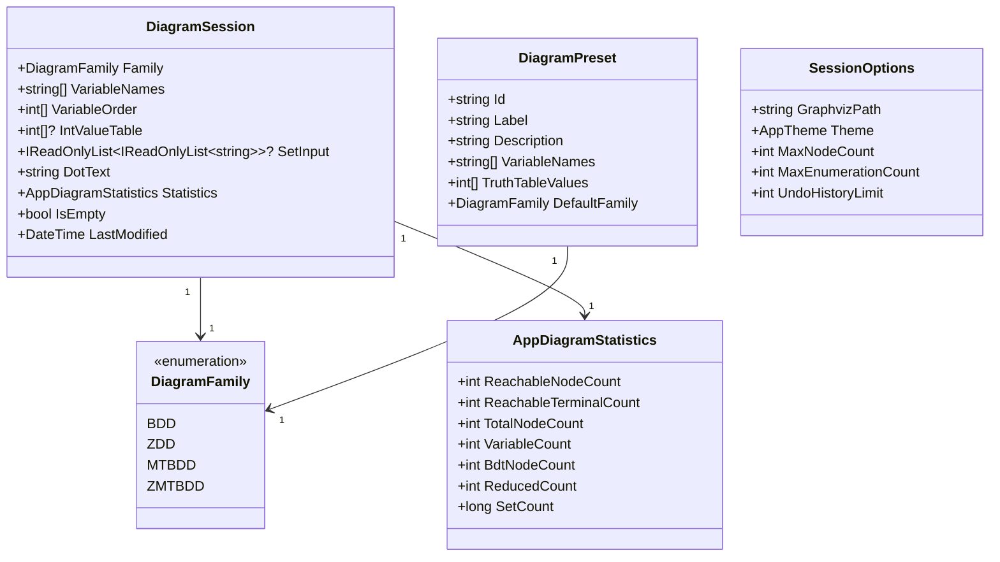

**`AppDiagramStatistics` の各フィールドの算出元:**

| フィールド | 算出元 | 対象ファミリー |
|---|---|---|
| `ReachableNodeCount` | `Manager.GetStatistics(handle).ReachableNodeCount` | 全ファミリー |
| `ReachableTerminalCount` | `Manager.GetStatistics(handle).ReachableTerminalCount` | 全ファミリー |
| `TotalNodeCount` | `Manager.GetStatistics(handle).TotalNodeCount` | 全ファミリー |
| `VariableCount` | `Manager.GetStatistics(handle).VariableCount` | 全ファミリー |
| `BdtNodeCount` | `2^VariableCount - 1`（削減前 BDT の非終端ノード数、アプリ層算出） | BDD のみ |
| `ReducedCount` | `BdtNodeCount - ReachableNodeCount`（BDT→BDD で削減された非終端ノード数、アプリ層算出） | BDD のみ |
| `SetCount` | `ZddManager.CountSets(zdd)` | ZDD のみ |

> **IQ-06 決定:** ステータスバーでは「Low==High 冗長ノード数」や `TotalNodeCount - ReachableNodeCount` の代替表示は採用しない。`Low==High` ノードはライブラリの canonicalization で生成時に消えるため、通常の到達ノード走査では 0 になる。`ReducedCount` は学習支援用に「削減前 BDT の非終端ノード数」から「削減後 BDD の到達可能非終端ノード数」を引いた値として定義する。

#### B3.2 DiagramService 内部のハンドル管理

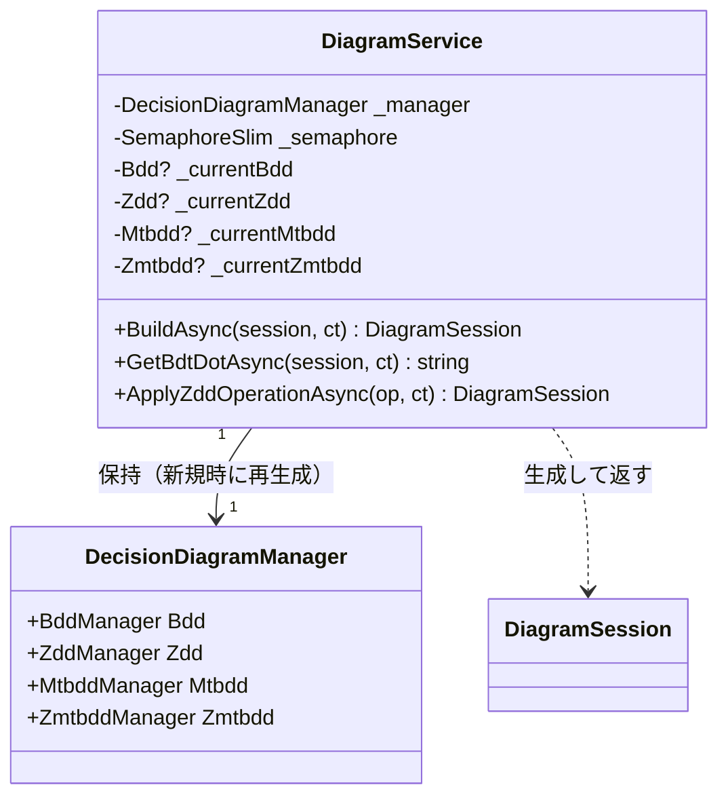

**ライフサイクル規則:**
- `DecisionDiagramManager` は DI に直接登録せず、`DiagramService` が内部フィールドとして保持する
- ファミリー切り替えは Manager の再生成を行わない。`_currentBdd` 等の使用フィールドを切り替えるだけである（ADR-006）
- 新規ボタンでは `DiagramService.ResetAsync()` が `SemaphoreSlim(1)` の critical section 内で新しい `DecisionDiagramManager` を生成し、`_currentBdd` 等のハンドルを破棄する（IQ-08）
- 新規操作は履歴境界として扱い、初版では `CommandStack` をクリアする

#### B3.3 ライブラリとアプリのデータ境界

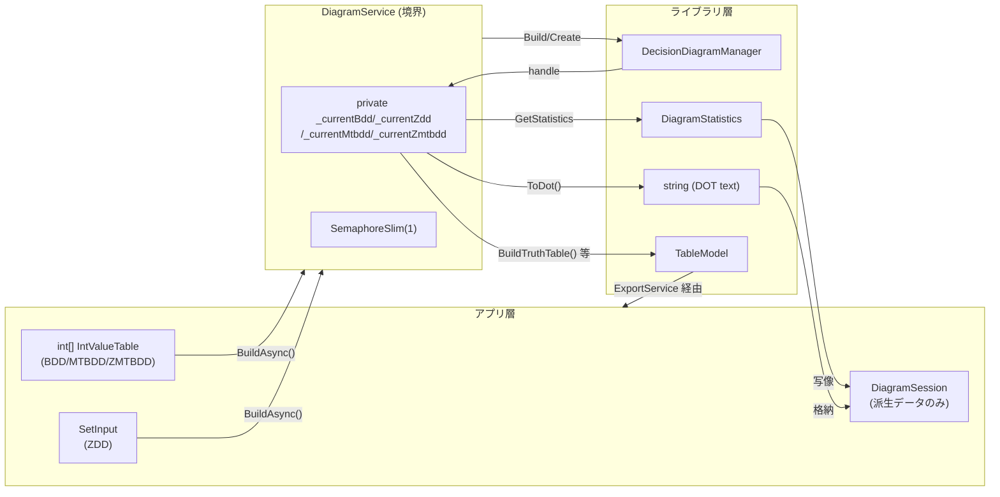

#### B3.4 状態遷移

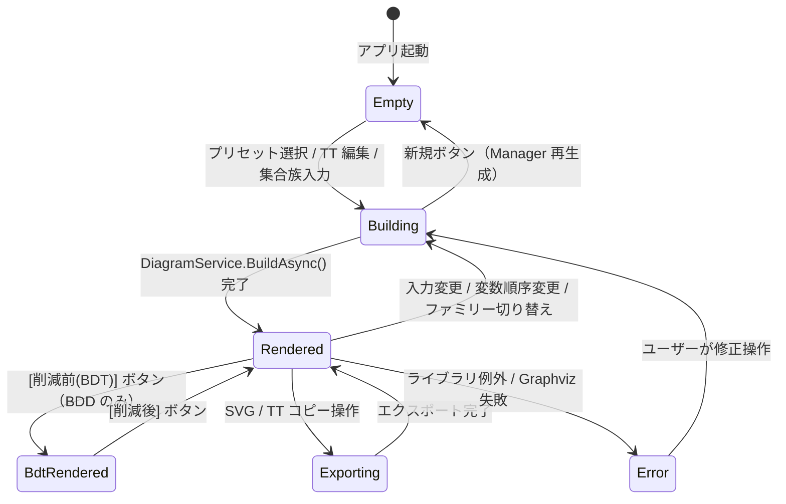

---

### B4. 並行性ビュー

本アプリは UI スレッドとバックグラウンドタスクの 2 種類のスレッドコンテキストで動作する。

#### B4.1 スレッドセーフティルール

| ルール ID | 内容 |
|---|---|
| **R-THREAD-01** | `DecisionDiagramManager`（および内包する全 Manager）は `DiagramService` が保持する `SemaphoreSlim(1)` で保護する。critical section の範囲は「Build/Create 呼び出し → `GetStatistics()` → `ToDot()`（DOT テキスト生成）」まで。DOT テキストは `string` なので critical section 外に持ち出せる |
| **R-THREAD-02** | `GraphvizService.RenderSvgAsync()` は critical section 外で実行する。Graphviz は外部プロセスであり Manager と無関係 |
| **R-THREAD-03** | `DispatcherQueue.TryEnqueue` でのみ UI プロパティを更新する。バックグラウンドスレッドから直接 `ObservableProperty` を変更しない |
| **R-THREAD-04** | Graphviz プロセスのタイムアウトは 30 秒とし、`CancellationToken` で管理する |
| **R-THREAD-05** | `WorkbenchViewModel` は `CancellationTokenSource` を保持し、新しい Build 要求時に前の `CancellationTokenSource.Cancel()` を呼ぶ |
| **R-THREAD-06** | `CommandStack` は UI スレッドからのみ操作する |

#### B4.2 実行モデル（修正版シーケンス）

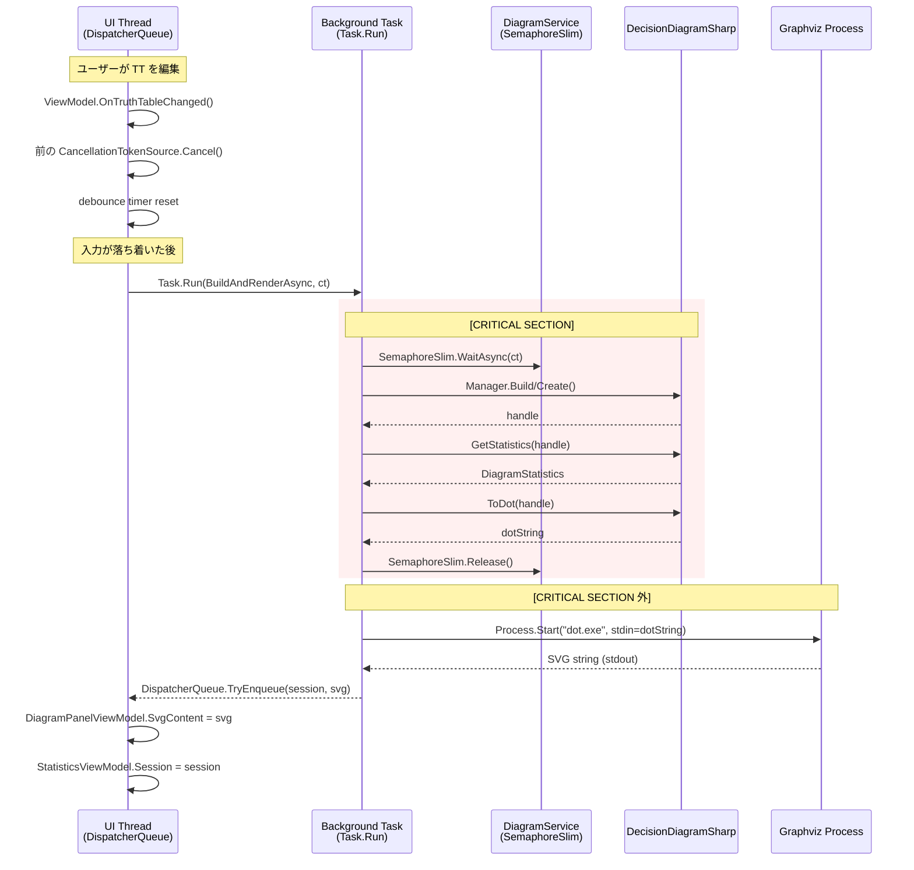

---

### B5. ランタイム/シナリオビュー

#### シナリオ 1: プリセット選択 → BDD 表示

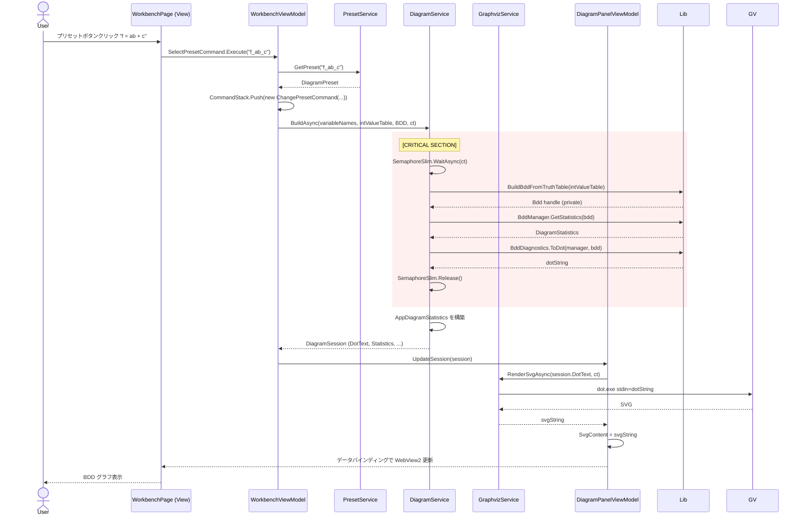

#### シナリオ 2: 削減前後切り替え（BDD 専用）

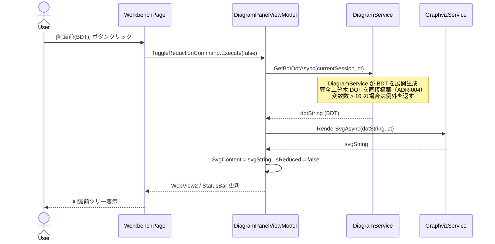

> **BDT 切り替えボタンの表示条件:** `DiagramFamily == BDD` の場合のみ表示する。ZDD / MTBDD / ZMTBDD では非表示（これらに削減前ツリーの概念はない）。

#### シナリオ 3: ZDD 集合族操作（v0.2 以降）

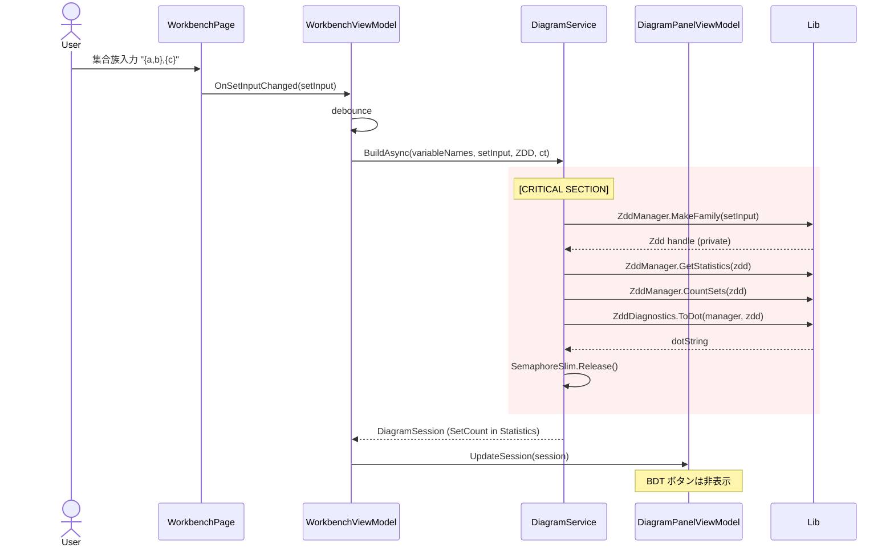

#### シナリオ 4: ノードクリック → 解説パネル更新

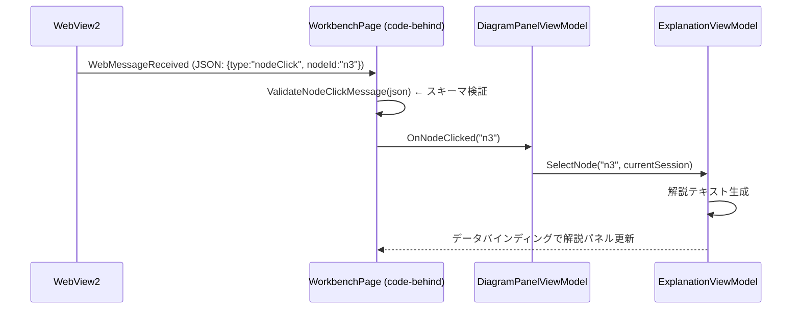

**WebView2 メッセージ形式（受信スキーマ）:**

```json
{
  "type": "nodeClick",
  "nodeId": "n3",
  "variableName": "b",
  "nodeType": "internal"
}
```

**バリデーション規則:**
- `type`: `"nodeClick"` 固定
- `nodeId`: `^n\d+$` パターンのみ受理
- `variableName`: `^[a-zA-Z_][a-zA-Z0-9_]*$` パターンのみ受理
- `nodeType`: `"internal"` | `"terminal"` のみ受理
- 上記以外は無効メッセージとしてログに記録しサイレントに無視する

SVG 生成時にノード要素へ `data-node-id`, `data-variable`, `data-node-type` 属性を付与し、埋め込み JavaScript で `window.chrome.webview.postMessage` を呼び出す。

---

### B6. 開発ビュー

#### B6.1 ソリューション構造

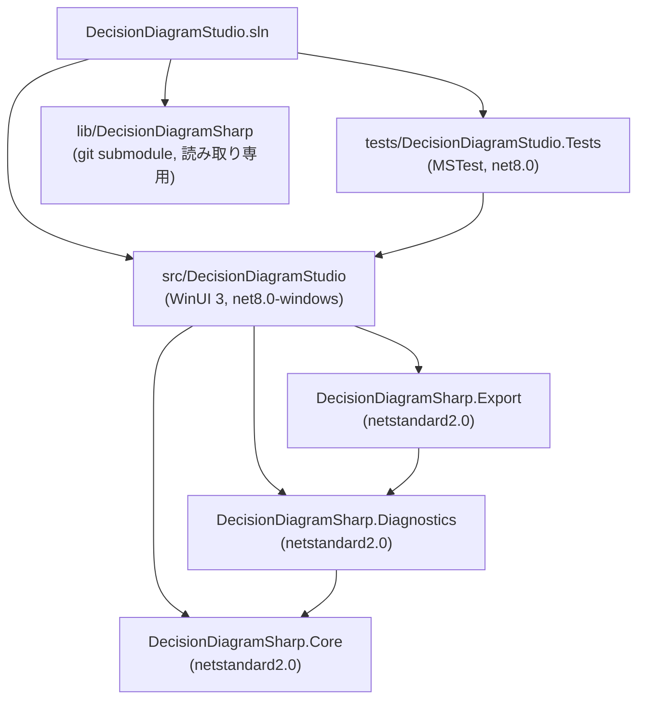

#### B6.2 ディレクトリ構造

```
DecisionDiagramStudio/
├── .gitmodules
├── DecisionDiagramStudio.sln
├── lib/
│   └── DecisionDiagramSharp/        ← git submodule (読み取り専用)
├── docs/
│   ├── architecture.md
│   └── requirements.md
├── src/
│   └── DecisionDiagramStudio/
│       ├── DecisionDiagramStudio.csproj
│       ├── App.xaml / App.xaml.cs   ← DI 設定のみ
│       ├── MainWindow.xaml          ← NavigationView ホスト
│       ├── Views/
│       │   ├── WorkbenchPage.xaml
│       │   ├── TruthTablePage.xaml
│       │   ├── VariableOrderPage.xaml
│       │   ├── StatisticsPage.xaml
│       │   └── SettingsPage.xaml
│       ├── ViewModels/
│       │   ├── WorkbenchViewModel.cs
│       │   ├── DiagramPanelViewModel.cs
│       │   ├── ExplanationViewModel.cs
│       │   ├── StatisticsViewModel.cs
│       │   └── SettingsViewModel.cs
│       ├── Services/
│       │   ├── Interfaces/
│       │   │   ├── IDiagramService.cs
│       │   │   ├── IGraphvizService.cs
│       │   │   ├── IExportService.cs
│       │   │   └── IPresetService.cs
│       │   ├── DiagramService.cs
│       │   ├── GraphvizService.cs
│       │   ├── ExportService.cs
│       │   └── PresetService.cs
│       ├── Commands/
│       │   ├── IUndoableCommand.cs
│       │   ├── CommandStack.cs
│       │   ├── ChangeTruthTableCommand.cs
│       │   ├── ChangeVariableOrderCommand.cs
│       │   └── ChangeFamilyCommand.cs
│       ├── Models/
│       │   ├── DiagramSession.cs
│       │   ├── DiagramPreset.cs
│       │   ├── AppDiagramStatistics.cs
│       │   └── SessionOptions.cs
│       ├── Infrastructure/              ← 横断的関心事（View/VM/Service/Model に非依存）
│       │   └── Logging/
│       │       ├── DailyFileLoggerProvider.cs   ← 日次ローテーション実装
│       │       └── LoggingConfiguration.cs      ← DI 登録ヘルパー
│       └── Assets/
│           ├── Presets/
│           │   └── presets.json
│           └── Strings/
│               ├── en-US/Resources.resw
│               └── ja-JP/Resources.resw
└── tests/
    └── DecisionDiagramStudio.Tests/
        ├── Services/
        │   ├── DiagramServiceTests.cs
        │   ├── GraphvizServiceTests.cs
        │   ├── ExportServiceTests.cs
        │   └── PresetServiceTests.cs
        ├── ViewModels/
        │   ├── WorkbenchViewModelTests.cs
        │   └── DiagramPanelViewModelTests.cs
        └── Commands/
            └── CommandStackTests.cs
```

#### B6.3 依存関係規則

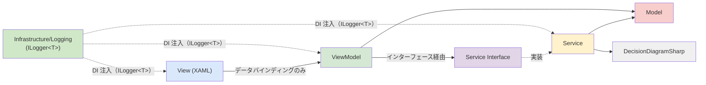

**禁止依存関係:**

| 禁止パターン | 理由 |
|---|---|
| View → Service (直接) | MVVM 原則違反 |
| View → Model (直接書き込み) | バインディング経由のみ許可 |
| ViewModel → DecisionDiagramSharp (直接) | Service 層を必ず経由する |
| Model → DecisionDiagramSharp | Model はライブラリ具象型（`Bdd` 等）を保持してはならない（ADR-006） |
| Service → View | 循環依存 |

#### B6.4 命名規則

| 種別 | 規則 | 例 |
|---|---|---|
| インターフェース | `I` プレフィックス + PascalCase | `IDiagramService` |
| ViewModel | `ViewModel` サフィックス | `WorkbenchViewModel` |
| コマンド（Undo 対象） | `Command` サフィックス | `ChangeTruthTableCommand` |
| Service | `Service` サフィックス | `GraphvizService` |
| XAML バインディング変数 | `ObservableProperty` + camelCase フィールド | `_svgContent` → `SvgContent` |
| async メソッド | `Async` サフィックス | `BuildAsync` |
| private フィールド | `_` プレフィックス + camelCase | `_semaphore` |

#### B6.5 コーディング規則

- **Nullable reference types** を有効にする（`<Nullable>enable</Nullable>`）
- **`TreatWarningsAsErrors` を有効**にする（CI で強制）
- **コメントは原則書かない** — 変数名・型名で意図を表現する。ハックや非自明な制約にのみ 1 行コメントを付ける
- **公開APIの説明** - 全てのpublicメソッドにXMLコメント形式でその概要や使い方を記載する
- **マジックナンバー禁止** — 定数か `SessionOptions` プロパティで定義する
- **`async void` 禁止** — イベントハンドラを除く。例外は `IAsyncRelayCommand` で包む
- **`Task.Run` のコンテキスト** — ライブラリ Manager 呼び出しは必ず `Task.Run` 内で実行し、UI スレッドをブロックしない
- **変数名バリデーション** — `DiagramService.BuildAsync()` の入口で変数名を `[a-zA-Z_][a-zA-Z0-9_]*` パターンで検証し、不正な場合は `ArgumentException` をスローする（IQ-09 決定）

---

### B7. 配置ビュー

#### B7.1 インストール構成

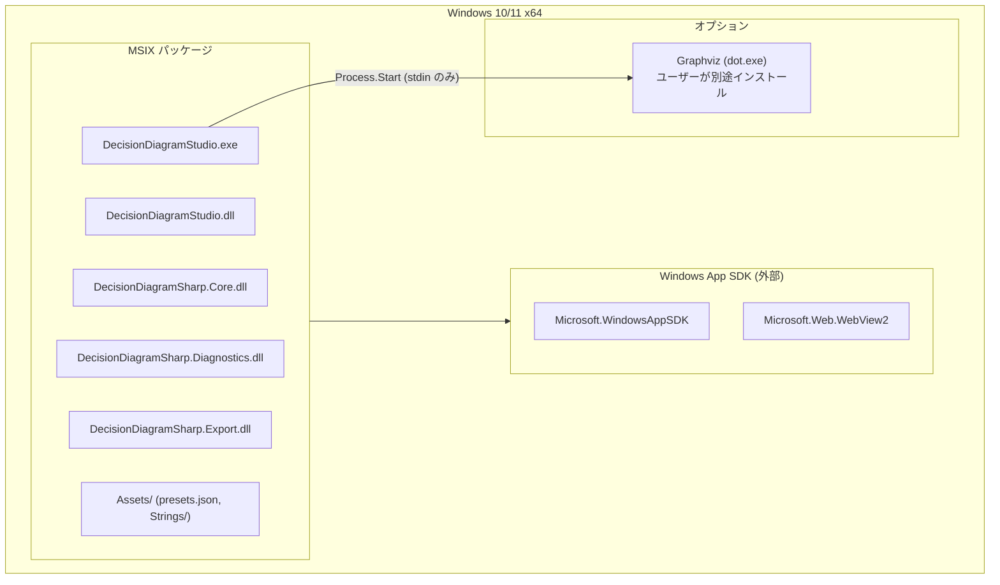

**ランタイム要件:**

| 要件 | 詳細 |
|---|---|
| .NET 8 Runtime | Windows App SDK にバンドル、または別途インストール |
| Windows App SDK 1.5+ | MSIX 依存関係として宣言 |
| WebView2 Runtime | Windows 11 には標準搭載。Windows 10 は Evergreen インストーラー |
| Graphviz 10.x | オプション。`dot.exe` のパスを設定ページで指定可 |

#### B7.2 設定ファイルの保存先

| 種別 | パス |
|---|---|
| アプリ設定 (`SessionOptions`) | `%LOCALAPPDATA%\DecisionDiagramStudio\settings.json` |
| ウィンドウ状態 | `ApplicationData.LocalSettings` (WinRT) |
| ログ | `%LOCALAPPDATA%\DecisionDiagramStudio\logs\app-{yyyyMMdd}.log`（日次ローテーション・最大30ファイル） |

---

### B8. 運用ビュー

#### B8.1 エラー処理フロー

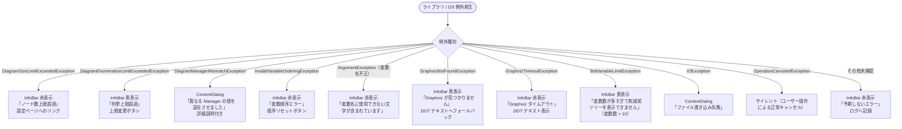

#### B8.2 ログ方針

ロギングは横断的関心事として `Infrastructure/Logging/` に独立実装する（B6.2 参照）。View / ViewModel / Service / Model はロギング実装に直接依存せず、`ILogger<T>` のみを参照する。

**ログレベル定義:**

| レベル | `LogLevel` | 使用場面 |
|---|---|---|
| Trace | `LogLevel.Trace` | 変数値・ループ内部など最も詳細な診断情報 |
| Debug | `LogLevel.Debug` | BDD 構築開始/完了・DOT 生成・SVG レンダリング呼び出しなど開発時診断 |
| Information | `LogLevel.Information` | プリセット選択・ファミリー切り替え・エクスポート実行などユーザー操作の記録 |
| Warning | `LogLevel.Warning` | Graphviz 未検出・ノード数 500 超警告・入力検証失敗 |
| Error | `LogLevel.Error` | ライブラリ例外・Graphviz タイムアウト・ファイル IO 失敗 |
| Critical | `LogLevel.Critical` | 未捕捉例外（`UnhandledException` ハンドラ内） |

フィルタリングは現時点では設けない（MinimumLevel = Trace 固定）。将来 `SessionOptions` への追加枠を予約するが v0.1 では実装しない。

**ログプロバイダー:**

| プロバイダー | 実装 | Debug ビルド | Release ビルド |
|---|---|---|---|
| ファイルログ（日次ローテーション） | `Serilog.Sinks.File` | 有効 | 有効 |
| Visual Studio 出力ウィンドウ | `Serilog.Sinks.Debug` | 有効（`Debugger.IsAttached` 時） | **無効** |

**ファイルログ仕様:**

| 項目 | 値 |
|---|---|
| 出力先 | `%LOCALAPPDATA%\DecisionDiagramStudio\logs\app-.log` |
| ファイル名形式 | `app-20260515.log`（日付付与: `RollingInterval.Day`） |
| 保持ファイル数 | 最大 30 ファイル（`retainedFileCountLimit: 30`） |
| エンコーディング | UTF-8 |

**ロギングルール:**

| ルール ID | 内容 |
|---|---|
| **R-LOG-01** | ロガーは `ILogger<T>` 経由で取得する。スタティックなロガー呼び出しは禁止 |
| **R-LOG-02** | ログにユーザー入力値を記録しない。例外メッセージに変数名が含まれる場合は `[REDACTED]` に置換する（B9.5 再掲） |
| **R-LOG-03** | `OperationCanceledException` はログしない（正常キャンセル） |
| **R-LOG-04** | `Infrastructure/Logging/` は View / ViewModel / Service / Model に依存しない。依存方向は `App.xaml.cs` → `Infrastructure` のみ |
| **R-LOG-05** | ファイルパス・保持数などの定数は `LoggingConfiguration` にまとめ、ハードコードしない |

---

### B9. セキュリティビュー

#### B9.1 脅威モデルの概要

```
信頼境界 1: ユーザー入力（変数名・真理値表・集合族）→ DiagramService
  リスク: DOT テキストへの特殊文字インジェクション
  対策: 入口バリデーション（A.4 方針9）

信頼境界 2: DiagramService → Graphviz プロセス
  リスク: コマンドインジェクション（引数経由）
  対策: ユーザー入力を引数に含めず、DOT テキストは stdin 専用

信頼境界 3: Graphviz SVG → WebView2
  リスク: SVG 内 <script> タグによるスクリプト実行
  対策: CSP による script-src 制限

信頼境界 4: WebView2 JS → C# ViewModel
  リスク: 不正 postMessage によるアプリ状態の汚染
  対策: JSON スキーマ検証 + パターンマッチング
```

#### B9.2 WebView2 セキュリティ設定

```csharp
// App.xaml.cs 内の WebView2 初期化（疑似コード）
webView.CoreWebView2.Settings.IsWebMessageEnabled = true;
webView.CoreWebView2.Settings.AreDefaultScriptDialogsEnabled = false;
webView.CoreWebView2.Settings.IsStatusBarEnabled = false;
webView.CoreWebView2.Settings.AreDevToolsEnabled = false; // Release ビルドのみ

// 外部ナビゲーション禁止
webView.CoreWebView2.NavigationStarting += (s, e) =>
{
    // NavigateToString の about:blank 以外へ遷移しようとした場合はキャンセル
    if (!string.Equals(e.Uri, "about:blank", StringComparison.OrdinalIgnoreCase)) e.Cancel = true;
};
```

**HTML 先頭に配置する CSP meta（`NavigateToString()` 経由）:**

```html
<meta http-equiv="Content-Security-Policy"
      content="default-src 'none'; script-src 'nonce-{random-per-load}'; style-src 'unsafe-inline'; img-src data:;">
```

SVG 表示は `ISvgWebViewDocumentSource`（仮称）で HTML 生成・nonce 生成・WebView2 への読み込み方式を抽象化する。v0.1 では `NavigateToString()` 実装を使い、HTML 文字列が 2 MB を超える場合、または HTTP response header 形式の CSP が必須になった場合は、同じインターフェースの実装を in-memory custom response 方式に差し替える。

#### B9.3 Graphviz プロセス起動規則

| 規則 | 内容 |
|---|---|
| **SEC-GV-01** | `dot.exe` へのユーザー入力渡しは stdin のみ。コマンドライン引数に変数名・関数名等のユーザー入力を含めない |
| **SEC-GV-02** | タイムアウト 30 秒で `Process.Kill()` を呼ぶ。`using` ブロックで必ず終了させる |
| **SEC-GV-03** | Graphviz 実行ファイルのパスは設定画面でユーザーが指定した絶対パスのみ使用する。PATH 環境変数検索はアプリ起動時の自動検出にのみ使用する |

#### B9.4 変数名・DOT テキストのサニタイズ

- 変数名の許容パターン: `^[a-zA-Z_][a-zA-Z0-9_]*$`（IQ-09 決定）
- バリデーション実施場所: `DiagramService.BuildAsync()` の冒頭
- ライブラリの `BddDiagnostics.EscapeDotLabel` は `"` と `\` のみエスケープするため、上記バリデーションを通過した変数名のみ渡すことで DOT ラベルの安全性を保証する
- 日本語を含む Unicode 変数名は v0.1〜v1.0 の仕様から除外する。表示名の多言語化が必要になった場合は、内部識別子と表示名を分離する別仕様として扱う

#### B9.5 プライバシー

- ユーザーデータ（真理値表・変数定義）はアプリ内でのみ評価し、ネットワーク送信は行わない
- ログにユーザー入力値を記録しない（例外メッセージに変数名が含まれる場合は `[REDACTED]` に置換する）

---

## C. 品質パースペクティブ

### C.1 性能

**測定条件の前提:** 全ての性能目標は「Graphviz プロセスが PATH 上に存在し、OS のプロセスキャッシュが温まった状態（warm start）」を前提とする。

| シナリオ | 目標値 | 測定起点 | 測定終点 | Graphviz 有無 | 対象変数数 | 計測方法 |
|---|---|---|---|---|---|---|
| TT セル変更→SVG 表示 | **固定閾値なし（回帰監視）** | TT セルクリック確定 | SVG が WebView2 に表示される | あり（warm） | ≤4変数 | Stopwatch on BG thread |
| TT セル変更→SVG 表示 | **1秒** | TT セルクリック確定 | SVG が WebView2 に表示される | あり（warm） | ≤8変数 | Stopwatch on BG thread |
| TT セル変更→DOT 表示 | **100ms** | TT セルクリック確定 | DOT TextBox に表示される | なし（フォールバック） | ≤8変数 | Stopwatch on BG thread |
| 削減前後切り替え | **500ms** | ボタンクリック | SVG が WebView2 に表示される | あり（warm） | ≤100ノード | Stopwatch on BG thread |
| アプリ起動 | **3秒** | プロセス起動 | WorkbenchPage がレンダリング完了 | 関係なし | N/A | ETW / Process.StartTime |

> **注:** 性能計測は回帰把握のための参考値として扱う。固定閾値を満たすために Graphviz の代替レンダラを追加せず、実際の Graphviz 出力とキャンセル可能な非同期処理を優先する。

**大規模グラフ対策:**

| ノード数 | 動作 |
|---|---|
| > 500 | レンダリング前に `InfoBar` 警告を表示する |
| > 1,000 | ユーザー確認ダイアログを表示してからレンダリングする |
| BDT で変数数 > 10 | BDT 表示を無効化し `BdtVariableLimitException` をスローする（`2^11-1 = 2047` ノードは 500 超警告対象のため） |

### C.2 安全性（クラッシュ耐性）

- 全ての `Task.Run` 内例外を `try/catch` で捕捉し `DiagramException` 系は UI に通知する
- `OperationCanceledException` はサイレントに無視する（正常キャンセル）
- Graphviz プロセスは `using` で管理し、例外発生時も必ず `Kill()` する
- `WorkbenchViewModel` の `CancellationTokenSource` を保持し、ユーザー操作時に前のタスクをキャンセルする

### C.3 可用性・回復性

- Graphviz がないときは DOT テキストを `TextBox` に表示するフォールバックを提供する（グラフなしでもアプリが動作する）
- `DiagramService` が内部エラーで不整合状態になった場合は、`DiagramService.ResetAsync()` と同じ経路で内部の `DecisionDiagramManager` を再生成するリカバリーパスを持つ

### C.4 保守性

- **Service インターフェース化** — `IDiagramService` / `IGraphvizService` / `IExportService` / `IPresetService` を定義し、テスト時はモックに差し替えられる
- **ViewModel の分割** — `WorkbenchViewModel` が肥大化しないよう `DiagramPanelViewModel` / `ExplanationViewModel` を分離する
- **プリセットを外部 JSON に分離** — `Assets/Presets/presets.json` で管理し、コード変更なしにプリセットを追加できる
- **文字列リソース化** — すべての UI 文字列を `Resources.resw` で管理し、ハードコードしない

### C.5 テスト容易性

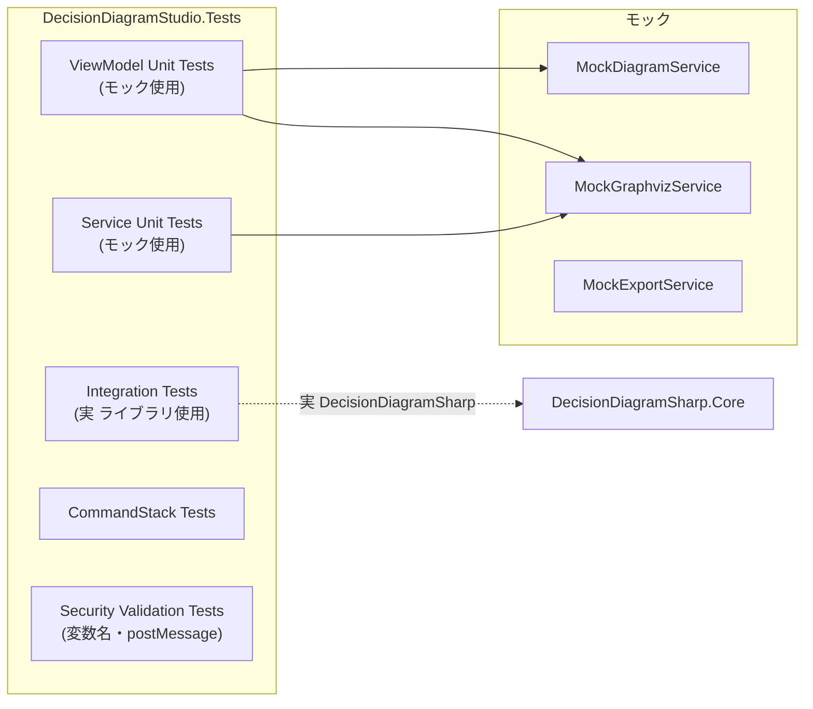

**カバレッジポリシー:**

| 対象 | カバレッジ目標 |
|---|---|
| `Services/` の全メソッド | 変更したメソッドは 100% |
| `ViewModels/` の全コマンド | 変更したコマンドは 100% |
| `Commands/` の Undo/Redo パス | 100% |
| `DiagramService.BuildBddFromTruthTable()` | 100%（全変数数・全TT値パターン） |
| View (XAML code-behind) | 除外（UI テストで代替） |

### C.6 セキュリティ・プライバシー

B9 セキュリティビュー参照。

### C.7 互換性・拡張性

**ファミリー追加（将来の MDD / ADD 対応）:**
- `DiagramFamily` 列挙型に値を追加する
- `DiagramService` に対応するビルドメソッドを追加し、ファミリー別責務対応表（B2）を更新する
- `WorkbenchViewModel` に分岐を追加する

**プリセット追加:**
- `Assets/Presets/presets.json` に JSON エントリを追加するだけでよい（コード変更不要）

**エクスポート形式追加:**
- `IExportService` にメソッドを追加し、`ExportService` で実装する
- `DecisionDiagramSharp.Export` に対応エクスポーターが存在する場合は委譲する

---

## D. 設計判断（ADR）

### ADR-001: MVVM フレームワークとして CommunityToolkit.Mvvm を採用

**ステータス:** 決定済み
**コンテキスト:** WinUI 3 向けの MVVM 実装が必要。
**決定:** `CommunityToolkit.Mvvm` を採用する。
**理由:**
- WinUI 3 公式推奨ライブラリ
- `[ObservableProperty]` / `[RelayCommand]` により ViewModel のボイラープレートを最小化できる
- `IAsyncRelayCommand` により非同期コマンドのキャンセルが容易
**代替案:** Prism（重い）、Reactive UI（学習コスト高）、手実装（不要な実装量）
**トレードオフ:** Source Generator 依存により、一部の IDE 機能（Navigate to Definition）が生成ファイルに飛ぶことがある

---

### ADR-002: DecisionDiagramSharp をサブモジュールとして管理

**ステータス:** 決定済み
**コンテキスト:** ライブラリはまだ NuGet 公開前。
**決定:** `lib/DecisionDiagramSharp` として git submodule で参照し、プロジェクト参照でビルドする。
**理由:**
- ライブラリの変更をアプリ側でもデバッグ可能
- NuGet 公開後は `.csproj` のプロジェクト参照をパッケージ参照に切り替えるだけで移行できる
**ルール:** サブモジュール内のコードを直接変更してはならない。必要な拡張はアプリ側に extension methods として書く

---

### ADR-003: グラフ描画に WebView2 + SVG を採用

**ステータス:** 決定済み（OQ-003 解決）
**コンテキスト:** WinUI 3 でグラフを表示する手段を選定する必要がある。
**決定:** Graphviz が生成した SVG を WebView2 で表示する。
**理由:**
- ライブラリが `ToDot()` で DOT テキストを提供するため Graphviz との連携が自然
- SVG は WinUI 3 の標準 UI 要素では表示困難だが WebView2 は SVG を完全サポート
- JavaScript から `postMessage` 経由でノードクリックイベントを C# へ伝達できる
**代替案:** `Microsoft.Msagl`（重い・ライセンス確認要）、D3.js（実装コスト高）、WinUI Canvas（手動描画でコスト高）
**セキュリティ対応:** SVG 表示時は CSP により script-src を nonce で制限する（B9 参照）
**トレードオフ:** Graphviz がオプションのため、未インストール時のフォールバック（DOT テキスト表示）が必要

---

### ADR-004: BDT（削減前ツリー）をアプリ層で生成し BDD 専用とする

**ステータス:** 決定済み（OQ-001 解決）
**コンテキスト:** ライブラリは削減前 BDT の生成 API を持たない。また ZDD / MTBDD / ZMTBDD には「削減前ツリー」という概念が存在しない。
**決定:**
1. `DiagramService.GetBdtDotAsync()` 内でアプリ層が BDT を展開生成する
2. BDT 切り替えボタンは `DiagramFamily == BDD` の場合のみ表示する
**実装方針:**
- 変数数 `n` に対して深さ `n` の完全二分木（`2^(n+1) - 1` ノード）を DOT テキストとして直接生成する
- ライブラリの `BddManager` を使わず、DOT 文字列を直接構築する（変数 ≤ 10 まで対応）
- 変数数 > 10 の場合は `BdtVariableLimitException` をスローし InfoBar 黄で通知する
**トレードオフ:** アプリ層での生成はライブラリの内部実装と独立するため、将来ライブラリが API を提供した場合は置き換える

---

### ADR-005: Undo/Redo を Command パターンで実装

**ステータス:** 決定済み（OQ-007 解決）
**コンテキスト:** TT 変更・変数順序変更・ファミリー切り替えを Undo/Redo 対象にする必要がある。
**決定:** `IUndoableCommand` インターフェースと `CommandStack` クラスを独自実装する。
**Undo の単位:** TT の 1 セル変更ごとではなく、デバウンス後の「確定操作」を 1 ステップとする
**理由:**
- CommunityToolkit.Mvvm の `RelayCommand` は Undo 対応していない
- 本アプリの操作は「状態スナップショットの差分」として単純に表現できる
- 上限 50 件のスタックで十分（メモリ消費も抑制される）

---

### ADR-006: DiagramSession からライブラリ具象型を除去する

**ステータス:** 決定済み（CRIT-01 対応）
**コンテキスト:** 旧設計では `DiagramSession` が `Bdd?`, `Zdd?`, `Mtbdd?`, `Zmtbdd?` を直接保持していた。
**問題:** `Bdd` 等の struct は `BddManager` への参照を内包するため、`DiagramSession` をモデル層に置くと「Model → DecisionDiagramSharp 依存禁止」規則（B6.3）に違反する。また ViewModel が Session 経由でライブラリAPIを直接呼べてしまう。
**決定:**
- `DiagramSession` はライブラリ具象型を一切保持しない
- ライブラリハンドル（`Bdd`, `Zdd` 等）は `DiagramService` の private フィールドにのみ存在する
- `DiagramSession` に格納するのは派生済みデータのみ: `DotText`（DOT 文字列）、`AppDiagramStatistics`、入力データのコピー（`IntValueTable`, `SetInput`）
- ファミリー切り替えは `DecisionDiagramManager` の再生成を行わない。`_currentXxx` フィールドの参照を切り替えるだけ
**トレードオフ:** `DiagramService` が状態（ハンドル）を持つためシングルトンとして DI 登録される。テスト時はインターフェース経由でモックに差し替える

---

### ADR-007: BDD 真理値表→BDD 構築方式

**ステータス:** 決定済み（IQ-01 対応）
**コンテキスト:** `BddManager` に `Create(int[])` 相当の API が存在しない。真理値表から BDD を構築するには ITE（if-then-else）演算を組み合わせる必要がある。
**決定:** `DiagramService.BuildBddFromTruthTable(int[] values, string[] variableNames)` を実装し、以下のアルゴリズムで構築する:
```
// LSB-first の変数順序で Shannon Expansion を再帰的に適用
// 変数 i をビット位置 i として走査し、各行を BDD ノードに変換する
for each minterm where values[mask] == 1:
    term = Var(0) if bit[0]==1 else Not(Var(0))
         & Var(1) if bit[1]==1 else Not(Var(1)) ...
    bdd = Or(bdd, term)
```
（最適化: 変数数が多い場合はコファクター分解を使用する）
**将来:** ライブラリが `Create(int[])` API を追加した場合は `DiagramService` 内の実装のみを切り替える

---

### ADR-008: SVG / WebView2 セキュリティモデル

**ステータス:** 決定済み（CRIT-06 / IQ-07 対応）
**コンテキスト:** Graphviz が生成した SVG を WebView2 で表示する際、SVG 内に `<script>` タグが含まれる場合がある（Graphviz の一部バージョン）。また WebView2 経由の `postMessage` は C# コードへの入力となる。
**決定:**
1. v0.1 では SVG を `NavigateToString()` で読み込み、HTML 先頭の CSP meta と per-render nonce により `script-src` を制限する
2. `postMessage` 受信時は JSON スキーマ検証とパターンマッチングを実施し、検証失敗時はサイレントに無視してログ記録する
3. 変数名は `[a-zA-Z_][a-zA-Z0-9_]*` パターンでバリデーション済みのもののみ DOT テキストに含める
4. HTML 文字列が 2 MB を超える場合、または HTTP response header 形式の CSP が必須になった場合は、`ISvgWebViewDocumentSource` の実装を in-memory custom response 方式へ差し替える

**代替案:** virtual host mapping は静的 asset 配信には有効だが、CSP ヘッダー付与の主手段としては採用しない。SVG を `` で表示する案はスクリプト実行を抑えやすいが、ノードクリックが取れないため不採用

---

### ADR-009: BDD ステータスバーの削減数を BDT→BDD 差分として定義

**ステータス:** 決定済み（IQ-06 対応）
**コンテキスト:** ライブラリの `DiagramStatistics` に `RedundantNodeCount` は存在せず、正常な BDD では `Low==High` ノードは canonicalization により生成されない。
**決定:** ステータスバーの削減数は「削減前 BDT の非終端ノード数 `2^n - 1`」から「削減後 BDD の到達可能非終端ノード数 `ReachableNodeCount`」を引いた `ReducedCount` とする。
**理由:** `Low==High` 走査は通常 0 になり、`TotalNodeCount - ReachableNodeCount` は manager 内の未到達ノード数であって削減効果ではない。BDT→BDD 差分は本アプリの学習支援目的と一致する。
**トレードオフ:** 「冗長」「共有」など削減理由別の内訳は初版では表示しない。必要になった場合はアプリ層の BDT 解析ロジックで別メトリクスとして追加する。

---

### ADR-010: 新規操作で DecisionDiagramManager を再生成する

**ステータス:** 決定済み（IQ-08 対応）
**コンテキスト:** `DecisionDiagramManager` と内包 manager は変数テーブルとノードプールを保持し、リセット API を持たない。
**決定:** 新規ボタン実行時は `DiagramService.ResetAsync()` で内部の `DecisionDiagramManager` を再生成し、現在のハンドルと `CommandStack` をクリアする。`DecisionDiagramManager` は DI に直接登録せず、`DiagramService` 内部で保持する。
**理由:** 変数テーブル、`TotalNodeCount`、truth table の変数 universe を新しいワークベンチに持ち越さないため。
**トレードオフ:** 新規操作を Undo 対象にするには旧 manager とハンドルの復元が必要になる。初版では新規操作を履歴境界として扱う。

---

### ADR-011: 変数名は ASCII 識別子のみ許可する

**ステータス:** 決定済み（IQ-09 対応）
**コンテキスト:** ライブラリは非空文字列なら変数名として登録できるが、DOT 生成・式パーサー・WebView2 セキュリティ境界では入力文字種を狭く保つ必要がある。
**決定:** v0.1〜v1.0 では変数名を `^[a-zA-Z_][a-zA-Z0-9_]*$` に限定する。日本語を含む Unicode 変数名は仕様から除外する。
**理由:** 論文・参考書の例でも ASCII 変数名が一般的であり、セキュリティ検証とテスト範囲を単純化できる。
**トレードオフ:** 日本語変数名の UX は提供しない。将来必要になった場合は、内部識別子と表示名を分離する別設計として扱う。

---

## E. トレーサビリティ

### E.1 要件ID → 設計要素 → テスト観点

| 要件 ID | 内容 | 設計要素 | テスト観点 |
|---|---|---|---|
| FR-001 | ファミリー選択 | `WorkbenchViewModel.SelectedFamily` → `DiagramService.BuildAsync(family)` | ラジオ切替→Session.Family 確認; DOT グラフタイプ確認 |
| FR-002 | 変数管理 | `WorkbenchViewModel.VariableOrder` → `BuildAsync(variableNames)` | 変数順序変更→再構築確認; `GetOrAddVariable` 呼び出し順 |
| FR-BDD-001 | TT 編集 | `ChangeTruthTableCommand` → `DiagramService` | TT 変更→`Session.IntValueTable` 反映; 0/1 トグル |
| FR-BDD-002 | プリセット呼び出し | `PresetService.GetPreset()` → `ChangePresetCommand` → `CommandStack` | プリセット選択→TT/変数名の即時更新; Undo でリセット |
| FR-BDD-003 | ランダム生成 | `RandomizeCommand` → `CommandStack` | 生成後 Undo で元の TT に戻ること |
| FR-BDD-004 | 削減前後表示 | `DiagramPanelViewModel.IsReduced` → `DiagramService.GetBdtDotAsync()` | BDT DOT に `2^(n+1)-1` ノードが存在すること; n>10 で例外 |
| FR-BDD-005 | 統計情報表示 | `AppDiagramStatistics` ← `BddManager.GetStatistics()` + BDT 非終端ノード数算出 | `ReducedCount = (2^VariableCount - 1) - ReachableNodeCount` の整合性 |
| FR-ZDD-001 | 集合族入力 | `DiagramSession.SetInput` → `ZddManager.MakeFamily()` | 空集合/単一集合/複数集合の入力 |
| FR-ZDD-002 | 集合族操作 | `DiagramService.ApplyZddOperationAsync()` → `ZddManager.Union()` 等 | Union 後の CountSets 検証 |
| FR-ZDD-003 | 集合族統計 | `AppDiagramStatistics.SetCount` ← `ZddManager.CountSets()` | 既知の集合族での件数一致 |
| FR-MTBDD-001 | 整数値TT入力 | `DiagramSession.IntValueTable` → `MtbddManager.Create()` | 2 変数の値テーブル→MTBDD 構築 |
| FR-MTBDD-002 | 評価・表示 | `MtbddDiagnostics.BuildValueTable()` → `StatisticsViewModel` | 全入力組合せの評価値確認 |
| FR-ZMTBDD-002 | ゼロ抑圧可視化 | `AppDiagramStatistics` で MTBDD/ZMTBDD の `ReachableNodeCount` 比較 | MTBDD > ZMTBDD のノード数確認（全0値テーブル） |
| FR-VIZ-001 | DOT→SVG | `GraphvizService.RenderSvgAsync()` | 正常 SVG 返却; 未インストール時フォールバック |
| FR-VIZ-002 | ノードクリック | WebView2 `postMessage` → `ExplanationViewModel` | クリック JSON 受信→ExplanationText 更新; 不正 JSON は無視 |
| FR-VIZ-003 | リアルタイム更新 | debounce + `CancellationToken` | 連続 TT 変更時に古い Build がキャンセルされること |
| FR-EXP-001 | TT コピー | `ExportService.CopyTruthTableAsync()` → Clipboard | CSV/Markdown/AsciiDoc 各形式の文字列検証 |
| FR-EXP-002 | SVG 保存 | `ExportService.SaveSvgAsync()` → FileSavePicker | ファイル存在確認; IOException ハンドリング |
| FR-UNDO-001 | Undo/Redo | `CommandStack.Push/Undo/Redo()` | 50 件上限; 上限超過で最古エントリが削除される |
| FR-SET-001 | Graphviz パス | `SessionOptions.GraphvizPath` → `GraphvizService` | 無効パス→InfoBar 表示; 自動検出成功/失敗 |
| NFR-PERF-1 | 応答性観測 | BG Thread + debounce + SemaphoreSlim | 4 変数 TT 変更→SVG 更新の E2E 時間を記録し、固定閾値ではなく回帰傾向を確認 |
| NFR-SEC-1 | セキュリティ | 変数名バリデーション + CSP + postMessage スキーマ検証 | `<script>` を含む変数名が拒否されること; 不正 postMessage が無視されること |

### E.2 OQ 状態一覧（要件書との統一版）

| OQ ID | 内容 | 状態 | 参照先 |
|---|---|---|---|
| OQ-001 | BDT 生成方法 | **決定済み** | ADR-004 |
| OQ-002 | 自由記述式入力 | 検討中（v0.2 以降） | — |
| OQ-003 | WebView2 ノードクリック伝達 | **決定済み** | ADR-003, B5シナリオ4 |
| OQ-004 | Graphviz 同梱可否 | 検討中（MSIX サイズ・ライセンス確認後） | — |
| OQ-005 | ナビバッジの値 | **決定済み** | TT バッジ = on-set 件数（`CountModels`）; 統計バッジ = `ReducedCount` |
| OQ-006 | 「その他」ナビ項目 | **決定済み** | v1.0 で CodeAnalysis 対応予約枠 |
| OQ-007 | Undo 単位 | **決定済み** | ADR-005 |
| OQ-008 | ZDD/MTBDD/ZMTBDD の TT 表示 | **決定済み** | ZDD は集合族表示; MTBDD/ZMTBDD は値テーブル表示（B2 ファミリー別責務表参照） |
| OQ-009 | 大規模グラフ UX | **決定済み** | ノード数 500 以上で警告, 1000 以上で確認ダイアログ（C.1 参照） |
| OQ-010 | CodeAnalysis UI | 未検討（ライブラリ v0.8 以降） | — |
| OQ-011 | Tweaks パネルの扱い | **決定済み** | v1.0 で設定ページに統合、開発中は左下フッターと共に残す |

---

## F. フェーズ別アーキテクチャ差分

| フェーズ | 稼働コンポーネント（追加分） | 無効化・非表示 | 主な実装制約 |
|---|---|---|---|
| **v0.1** | BddManager, GraphvizService, PresetService, WorkbenchViewModel, DiagramPanelViewModel, BDT DOT 生成 | ZDD/MTBDD/ZMTBDD ラジオボタン（グレーアウト）, ExportService, CommandStack | `DiagramFamily` は BDD のみ有効。`BuildAsync` は BDD 以外で `NotSupportedException` をスローする |
| **v0.2** | + ZddManager, ExportService, CommandStack, TruthTablePage（ZDD 集合族表示）, Undo/Redo | MTBDD/ZMTBDD ラジオボタン（グレーアウト） | ZDD 入力 UI（集合族テキスト）が必要。ZDD で BDT ボタンは非表示 |
| **v0.3** | + MtbddManager, ZmtbddManager, 値テーブル UI, 解説パネル拡充 | CodeAnalysis UI | MTBDD/ZMTBDD の入力列は整数値に変わる |
| **v0.4** | + 設定永続化（`settings.json`）, 多言語リソース（ja-JP/en-US）, UI 洗練 | Tweaks パネル（設定ページへ統合） | `SessionOptions` のシリアライズ/デシリアライズ実装 |
| **v1.0** | + CodeAnalysis UI（ライブラリ v0.8 依存）, MSIX 署名, Store 提出対応 | — | Store 提出要件（パッケージ化・署名・プライバシーポリシー） |

---

## G. 未解決事項

以下はアーキテクチャレベルの決定事項と残課題である。

| ID | 分類 | 状態 | 決定 / 事項 | 優先度 | 影響フェーズ |
|---|---|---|---|---|---|
| IQ-06 | 統計 | 決定済み | 「Low==High 走査」および `TotalNodeCount - ReachableNodeCount` 代替は採用しない。ステータスバーの `ReducedCount` は BDT→BDD の非終端ノード削減数として定義する（ADR-009） | 高 | v0.1 |
| IQ-07 | セキュリティ | 決定済み | v0.1 は `NavigateToString()` + 先頭 CSP meta + nonce を採用し、2 MB 超過または header CSP 必須時に in-memory custom response へ移行する（ADR-008） | 高 | v0.1 |
| IQ-08 | ライフサイクル | 決定済み | 新規ボタン時は `DiagramService` 内部の `DecisionDiagramManager` を再生成し、変数テーブルとノードプールをリセットする（ADR-010） | 中 | v0.1 |
| IQ-09 | セキュリティ | 決定済み | 変数名は ASCII 識別子 `^[a-zA-Z_][a-zA-Z0-9_]*$` のみ許可する。日本語変数名は仕様から除外する（ADR-011） | 中 | v0.1 |
| IQ-10 | 性能 | 未決定 | BDT 深さ制限: 変数数 > 10 で無効化（ADR-004）だが、BDT ノード数 `2^11-1 = 2047` は 1000 超確認ダイアログの対象。BDT 専用の上限警告 UI が必要か確認する | 低 | v0.1 |
